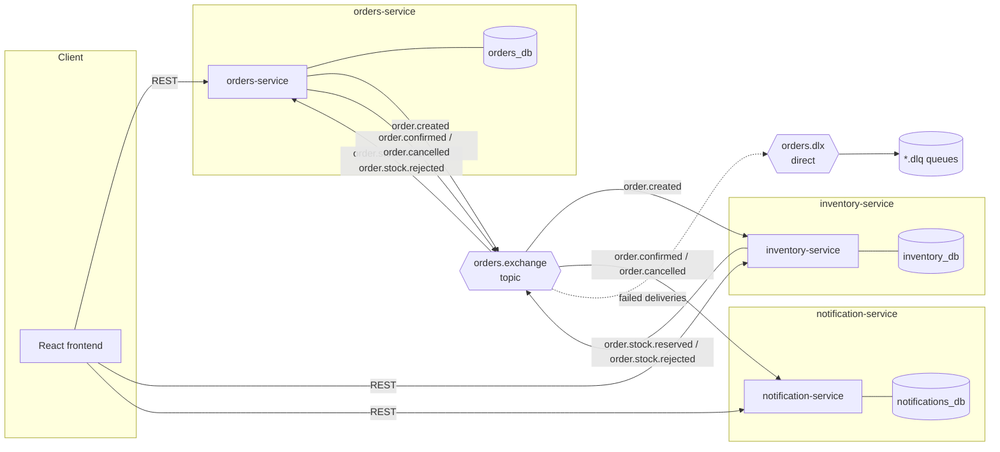

# Architecture

Pedidos is a distributed order-processing system split into three independently
deployable services that coordinate exclusively through asynchronous events on a
shared RabbitMQ topic exchange. There is no synchronous service-to-service HTTP
traffic anywhere in the system — every cross-service interaction is a message.

## System diagram

## Services and data ownership

Each service owns its own PostgreSQL database. No service ever queries another
service's database directly — the only contract between services is the shape of
the events they publish and consume. This is deliberate: it's what lets each
service be deployed, scaled, and evolved independently.

| Service | Owns | Responsibility |
|---|---|---|
| `orders-service` | `orders_db` (`orders`, `order_items`) | Order lifecycle: create, read, manual cancel, and the state machine `CREATED → CONFIRMED \| CANCELLED` driven by inventory's response |
| `inventory-service` | `inventory_db` (`products`, `stock_reservations`) | Product catalog, stock levels, and reserving stock against incoming orders with optimistic locking |
| `notification-service` | `notifications_db` (`notifications`) | Recording (and logging) a notification once an order reaches a terminal state |

## Why choreography, not orchestration

This saga is **choreography-based**: there is no central coordinator that tells
each service what to do next. Each service reacts to events on the exchange and
publishes its own events in response, and the overall order lifecycle emerges
from that chain of reactions.

The alternative — **orchestration** — would introduce a saga orchestrator that
owns the workflow definition, explicitly calls each service (or sends them
commands) in sequence, and tracks progress centrally.

Trade-offs, concretely for this system:

- **Coupling.** Choreography keeps each service coupled only to the *events* it
  cares about, not to a workflow definition that lives in another codebase. Any
  service can be added, removed, or changed without touching an orchestrator.
  Orchestration centralizes the workflow, which makes the end-to-end process
  easier to read in one place but couples every participant to that
  orchestrator's contract.
- **Traceability.** With orchestration, "what happens next" is explicit in one
  place. With choreography, the flow is implicit — reconstructing "why did this
  order get cancelled" means following routing keys across services' logs. This
  system compensates for that by propagating the order id as the AMQP
  correlation id on every message (see [event-flow.md](./event-flow.md)), so logs
  across all three services can be correlated even without a central log of the
  workflow itself.
- **Complexity growth.** Choreography works well here because the saga is
  short — two decision points, three services. Orchestration tends to win once a
  saga has many steps, branches, or needs centralized retry/compensation logic
  that would otherwise be duplicated across services.
- **Failure handling.** Neither pattern gives you failure handling for free.
  Here, resilience comes from idempotent consumers (a redelivered event is a
  safe no-op) and per-queue dead-letter queues (a poison message is retried a
  bounded number of times, then quarantined instead of blocking the queue) —
  not from the choreography pattern itself.

For a saga this size, choreography was chosen to keep the three services
genuinely independent and to avoid introducing a fourth service (the
orchestrator) whose only job would be to sequence two decisions.

## Resilience

- **Idempotency**: every consumer checks whether it has already processed a
  given order before acting (`existsByOrderId` for inventory-service and
  notification-service; a state-machine guard — only transition orders still in
  `CREATED` — for orders-service). RabbitMQ's at-least-once delivery means the
  same message can arrive more than once; none of these consumers double-apply
  side effects when that happens.
- **Optimistic locking**: `Product.version` (a JPA `@Version` column) ensures two
  concurrent orders for the same last unit of stock can't both succeed. The
  loser gets a fresh retry (up to 3 attempts) against re-read stock; if it still
  loses, the order is rejected with a clear reason rather than silently
  overselling.
- **Dead-letter queues**: every consumer queue is declared with
  `x-dead-letter-exchange` pointing at a shared `orders.dlx`. A message that
  keeps failing (3 retries with backoff) is rejected without requeue and lands
  in its queue's dedicated `.dlq`, where it stays visible for inspection instead
  of blocking the live queue forever.
