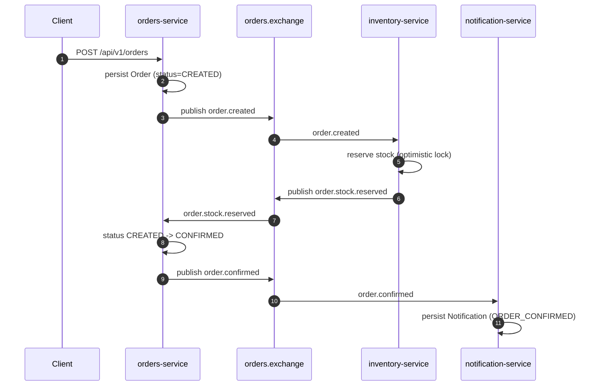
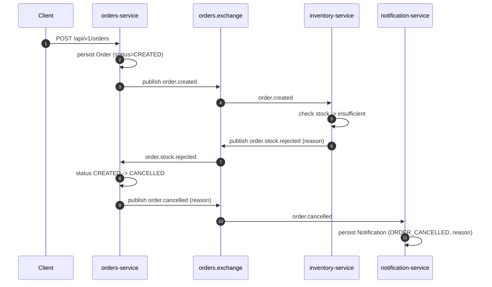

# Event flow

All events are published to a single durable topic exchange, `orders.exchange`.
Each consumer binds its own durable queue to the exchange with the routing
key(s) it cares about — there's no shared queue between services.

| Routing key | Publisher | Consumer(s) | Payload |
|---|---|---|---|
| `order.created` | orders-service | inventory-service | `{ orderId, customerId, items: [{ productId, quantity }], occurredAt }` |
| `order.stock.reserved` | inventory-service | orders-service | `{ orderId, customerId, occurredAt }` |
| `order.stock.rejected` | inventory-service | orders-service | `{ orderId, customerId, reason, occurredAt }` |
| `order.confirmed` | orders-service | notification-service | `{ orderId, customerId, occurredAt }` |
| `order.cancelled` | orders-service | notification-service | `{ orderId, customerId, reason, occurredAt }` |

Every message carries the order id as the AMQP `correlation_id` property, so the
full lifecycle of one order can be grepped out of all three services' logs even
though no single service sees the whole picture.

## Happy path: stock available

## Rejection path: insufficient stock

## Idempotency per consumer

RabbitMQ guarantees at-least-once delivery, so every consumer must tolerate
redelivery of a message it already handled.

- **inventory-service** (`order.created`): before reserving anything, checks
  `stockReservationRepository.existsByOrderId(orderId)`. If a reservation
  already exists for that order, the message is a no-op — stock is never
  double-deducted.
- **orders-service** (`order.stock.reserved` / `order.stock.rejected`): only
  transitions the order if it is still in `CREATED`. A redelivered event on an
  order that has already moved to `CONFIRMED` or `CANCELLED` is ignored, so the
  terminal state can never be flipped by a duplicate.
- **notification-service** (`order.confirmed` / `order.cancelled`): checks
  `notificationRepository.existsByOrderId(orderId)` before persisting, so a
  redelivered event never creates a second notification for the same order.

## Concurrency: two orders for the last unit

`Product.stockQuantity` is decremented under a JPA `@Version` optimistic-lock
column. When two `order.created` messages for the same product are processed
close together:

1. Both read the product row and see the same (pre-decrement) stock.
2. Both attempt to save a decremented value in their own transaction.
3. The first `UPDATE ... WHERE id = ? AND version = ?` to commit wins; the
   second affects zero rows and Hibernate raises an optimistic-locking failure.
4. inventory-service catches that failure and retries the whole reservation
   (re-reading fresh stock) up to 3 times before giving up and rejecting the
   order.

This is exercised directly by
[`StockReservationConcurrencyTest`](../inventory-service/src/test/java/com/pedidos/inventory_service/service/StockReservationConcurrencyTest.java),
which fires two concurrent reservation attempts at a product with exactly one
unit of stock and asserts only one succeeds.

## Dead-letter queues

Every consumer queue is declared with `x-dead-letter-exchange` /
`x-dead-letter-routing-key` pointing at a shared `orders.dlx` direct exchange,
with a dedicated `<queue-name>.dlq` bound to it. The listener container retries
a failing message 3 times (1s → 2s → 10s backoff) before rejecting it without
requeue, which RabbitMQ routes to the dead-letter queue instead of redelivering
it forever. The original message, along with `x-death` headers describing why
it failed, stays visible in the `.dlq` for inspection.
